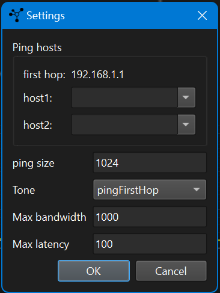

# Network Tool

### Overview

Network Tool is an application designed to measure network speed and performance between hosts in a Local Area Network (LAN). The tool includes features such as running an iperf server, performing ping tests, and more. This README provides essential information on setting up, running, and using the application.

### Use-cases

- Your wifi network is slow at some places and you want to figure out the **deadspots** by walking around with your laptop.
- Your **video call** sometimes stutters but you don't know if it's related to your network.
- You doubt if your router can handle the traffic now you **upgraded** to a higher speed.
- You wonder if your **ISP** delivers a stable througput
- Your online game sometime **stutters**, but why?

### Features

- **Iperf Server**: Runs an iperf server to measure network speed between two hosts in the LAN.
- **Ookla Speedtest**: Performs a speed test using Ookla Speedtest to measure network speed.
- **Ping Tests**: Performs ping tests to measure latency and packet loss.
- **Graphical Visualization**: Provides graphical visualization of network statistics.
- **Background Polling**: Monitors network interfaces and SSID changes in the background.
- **Data Export**: Allows exporting the network statistics to CSV files.
- **Audible status**: A tone can be played to help the user sense the networks state without looking at the screen. The frequency of the tone indicates the state. This allows the user to walk around with the laptop to find dead spots or to tweak the network settings without having to constantly check the screen.


<br/><i>Measure ping latency to first hop and to Google Meet video server</i><br/>

<br/><i>Measure alternating up/download from Ookla</i><br/>

<br/><i>Settings dialog</i><br/>

## Install & run using the installer

### Installation
Download the networktool.exe file from the releases page and run it. The installer creates startmenu entries.

### Running NetworkTool

Just start the Networktool from your Windows start menu.

## Install & run using the sourcecode (for developers)

#### Prerequisites

- Python
- git
- Inno Setup (for creating Windows installers) (downloaded & installed from the package.bat script)

#### Steps

1. **Clone the Repository**:
   ```sh
   git clone <repository_url>
   ```

2. **Install Dependencies**:
   ```sh
   poetry install
   ```

3. **Create Windows Installer** (Optional):
   run the 
   ```sh
   package.bat
   ```

#### Running NetworkTool as a developer

To run the application, execute the following command:
```sh
python src/main.py
```


### Using the Iperf Server

To measure network speed between two hosts in the LAN:

1. Install NetworkTool on both hosts in the LAN.
2. Start the iperf server on host A from the windows menu or by running ```iperf -s```.
3. On host B, use the 'Start Iperf' feature in the application to measure network speed.

### License

This project is licensed under the GPL-3.0 License. See the `LICENSE` file for more details.

### Contact

For any questions or issues, please use the github issue tracker.


